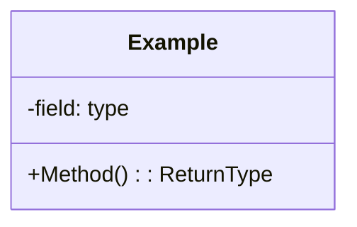

# OOP Design Scorecard — Submission Template

**Master template for evaluating object-oriented design quality.**

This scorecard is used to assess code submissions across all 14 weeks. Complete
one copy per submission, following the Explanation Quality Rubric guidelines
in `SYLLABUS.md` section 3.2.

---

## Lab Identification

- **Week**: [W1–W14]
- **Lab**: [Title, e.g., "Inheritance: Shape Hierarchy"]
- **Student Name**: ____________________
- **Submission Date**: ____________________
- **Files in scope**: [List .cs files submitted]

---

## Scoring Rubric (10 points total)

### 1. **Encapsulation** (2 points)
*Fields are private; state is reached through methods or properties that guard invariants.*

| Score | Evidence |
|-------|----------|
| **2** | All fields private or readonly. Properties validate on set. Invariants protected. No leaking internal state via public fields. |
| **1** | Most fields private, but some public fields exist or minimal validation. Invariants partially protected. |
| **0** | Public fields common. No validation. State can be corrupted. |

**Instructor notes**: C# conventions favor auto-properties `{ get; set; }` with private backing when simple; use explicit setters for validation. Records and init-only properties are excellent for value types.

---

### 2. **Single Responsibility** (2 points)
*Each class has one clear reason to change (one stakeholder/requirement).*

| Score | Evidence |
|-------|----------|
| **2** | Each class addresses one domain concern. Change in requirements affects only that class. No "God objects." |
| **1** | Classes mostly single-purpose, but some blend concerns (e.g., `Employee` handles both salary calc AND tax filing). Refactoring would help. |
| **0** | Classes have multiple unrelated jobs. Changing one feature requires editing unrelated code. |

**Instructor notes**: Ask "If the business requirement changes, how many classes need to change?" If the answer is >1, SRP may be violated. Domain-driven design (DDD) helps here.

---

### 3. **Clear Naming** (2 points)
*Every type, member, and parameter name describes *purpose*, not implementation.*

| Score | Evidence |
|-------|----------|
| **2** | Names are domain-specific: `EmailNotifier`, `CalculateGrossSalary()`, `isValidEmail`. No `Helper`, `Util`, `Mgr`, `data`, `obj`, `tmp`. |
| **1** | Most names are clear, but occasional generic terms (`Manager`, `Process()`, `result`). Clarity is reduced. |
| **0** | Names are cryptic or implementation-focused: `obj1`, `CalcX()`, `temp`. Intent is unclear. |

**Instructor notes**: Use Ubiquitous Language from the business domain. Abbreviations should be standard (e.g., `Id`, `Url`). Boolean methods should start with `Is`, `Has`, `Can`.

---

### 4. **Testability** (2 points)
*Public API is exercised by tests; tests do not reach into private state via reflection.*

| Score | Evidence |
|-------|----------|
| **2** | Comprehensive unit tests covering public API. Tests are independent, repeatable, fast. No reflection hacks. |
| **1** | Some tests exist but coverage is partial. Tests may be slow or dependent on test order. Few reflection issues. |
| **0** | No tests, or tests reach into private state via reflection. Tests are fragile or interdependent. |

**Instructor notes**: Follow AAA (Arrange–Act–Assert). One assertion per test is ideal. Mock external dependencies. Tests should read like specifications.

---

### 5. **Documentation** (1 point)
*Public types and members carry XML doc comments describing intent, parameters, return values, exceptions.*

| Score | Evidence |
|-------|----------|
| **1** | Public types, methods, properties, and exceptions have `/// 
`, `<param>`, `<returns>`, `<exception>` comments. Docs are accurate. |
| **0** | Missing or inaccurate XML docs. No description of exceptions. Comments don't match code. |

**Instructor notes**: XML docs are C# standard (not optional). Use IntelliSense to check readability. Docs should explain *why*, not repeat what the code says.

---

### 6. **Immutability Where Possible** (1 point)
*Fields that don't need to change are `readonly` or `init`-only. Value-like types are records or structs.*

| Score | Evidence |
|-------|----------|
| **1** | Immutable fields, properties use `init`, value types are `record` or `struct`. Mutable state is justified. |
| **0** | Unnecessary mutable fields. All properties use `{ get; set; }` even when reads-only. |

**Instructor notes**: Immutability reduces bugs and thread-safety concerns. C# 9+ records are idiomatic for value types. Use `readonly` heavily.

---

## Self-Assessment (Honest Reflection)

For **each criterion**, rate yourself and provide a **one-sentence justification**:

| Criterion | Rating | Justification |
|-----------|--------|---|
| Encapsulation | **2 / 1 / 0** | |
| Single Responsibility | **2 / 1 / 0** | |
| Clear Naming | **2 / 1 / 0** | |
| Testability | **2 / 1 / 0** | |
| Documentation | **1 / 0** | |
| Immutability | **1 / 0** | |
| **TOTAL** | **/10** | |

---

## Required Explanation (4–8 sentences)

*Use the Explanation Quality Rubric (section 3.2 of SYLLABUS.md).*

For **each criterion where you scored <2**, explain **why** the gap is acceptable for this lab.  
For **each criterion where you scored 2 (or 1 if max is 1)**, state the **mechanism** that makes it true.

Explain as if you were teaching a peer:

---

## Visual Deliverables (if required by the lab)

- [ ] **UML class diagram** (PNG, SVG, or Mermaid embedded below)
- [ ] **Sequence diagram** (if W14 or interaction-heavy; Mermaid or image)

### Diagram section:

---

## Instructor Feedback

*For instructors: Use this section to record feedback after review.*

**Strengths:**

**Areas for improvement:**

**Grade:** ___ / 10

